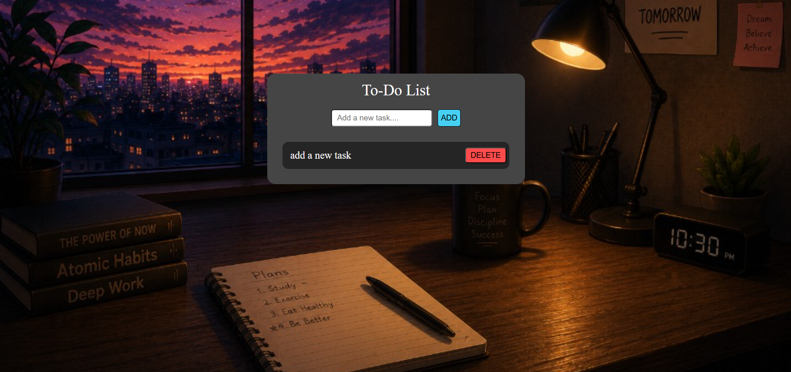

# 📝 To-Do List App

A simple and responsive To-Do List web application built using HTML, CSS, and JavaScript with Local Storage support.

## 🌐 Live Demo

🔗 [Click Here to Use the App](https://gandhigarvit01.github.io/To-Do-List/)

---

## 📸 Preview



---

## ✨ Features

- Add new tasks
- Delete tasks
- Local Storage support
- Tasks persist after page refresh
- Clean and responsive UI
- Input validation

---

## 🛠️ Built With

- HTML5
- CSS3
- JavaScript (Vanilla JS)
- Local Storage API

---

## 📂 Project Structure

```text
todo-list/
│
├── index.html
├── style.css
├── logic.js
├── preview.png
└── README.md
```

---

## 🚀 Getting Started

1. Clone the repository

```bash
git clone https://github.com/your-username/todo-list.git
```

2. Open `index.html` in your browser.

---

## 🎯 What I Learned

- DOM Manipulation
- Event Handling
- Dynamic Element Creation
- Local Storage
- JSON.stringify() & JSON.parse()
- Array Methods (`filter`, `push`)

---

## 👨‍💻 Author

**Garvit Gandhi**

- GitHub: https://github.com/gandhigarvit01
